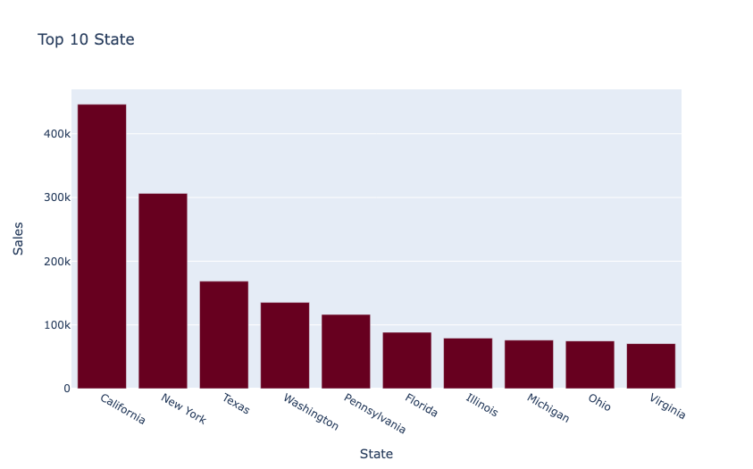
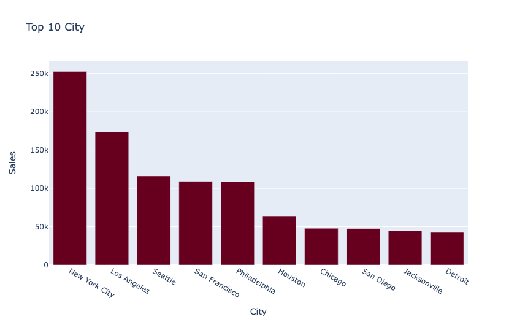
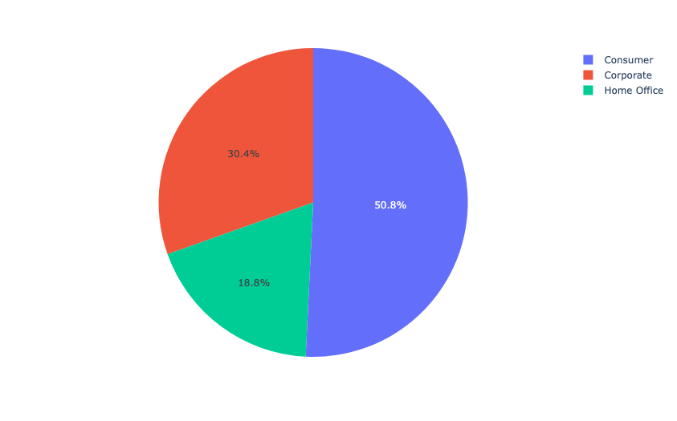
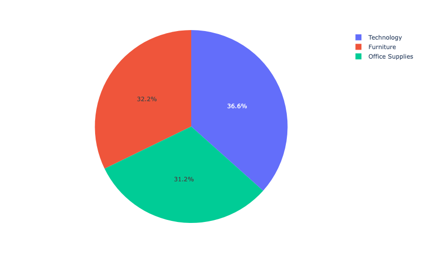
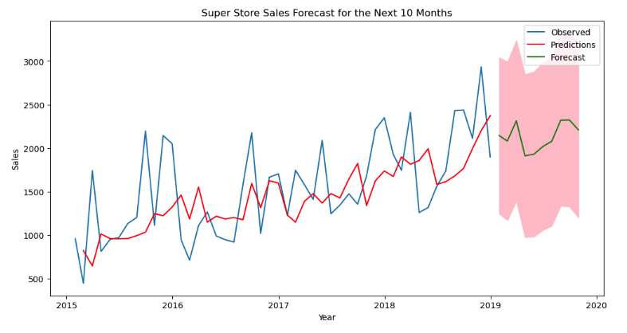

# Store-Sales-Forecast-with-SARIMA
- [Project Goal](#Project-Goal)
- [File Descriptions](#File-Descriptions)
- [Instructions](#How-To-Run-This-Project)
- [Exploratory Data Analysis (EDA)](#EDA)
- [SARIMA Model](#Model)
- [Licensing, Authors, Acknowledgements](#License)

## Project Goal 
The goal of this project is to forecast the sales of a superstore over a 10-month period using the SARIMA model to forecast time series data.

**Background:** The given dataset contained sales of a superstore from 2015 to 2018. The store's products are technology, furniture, and office supplies.

## File Description 
There are 2 files in this repository.  
A jupyter notebook `.ipynb` entails the analysis.  
A README.md file as a brief look at this repository.

## Instructions 
* Execute the codes in this notebook and follow along with the insights to understand the decisions made throughout the process.
* This project can also be found in my Kaggle [post](https://www.kaggle.com/code/azeotrope/store-sales-forecasting-with-sarima)

## Exploratory Data Analysis (EDA) 

Figure 1. Top 10 states where the store's sales are from.

Figure 2. Top 10 cities generate sales for the store.

Figure 3. Portions of customers purchase from the superstore.

Figure 4. Sales distributions from the three product categories: technology, furniture, and office supplies.

## SARIMA Model 
The model is first built on the train set, then predicts the sales on the test set. 
The mean forecast error of this model is 132.72 which indicates **under-forecasting**. 

Figure 5. Model's prediction on the given dataset and its forecast for the next 10 months.

The model is then fit and trained on the whole original dataset, then forecast the sales for the next 10 months. 
The model predicts a sales revenue more conservatively in contrast with the actual sales that is quite fluctuated.

## Licensing, Authors, Acknowledgements 
* The data set, licensing, and other descriptive information are described here [Kaggle](https://www.kaggle.com/datasets/rohitsahoo/sales-forecasting)
